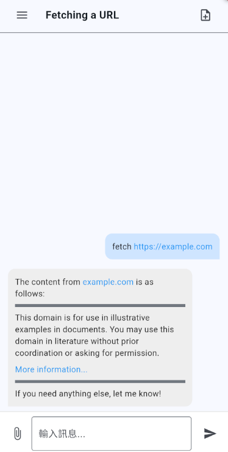

# Dive-APP

> This project is inspired by [Dive](https://github.com/OpenAgentPlatform/Dive), aiming to provide a smarter conversation experience for mobile devices.

<p align="center">
  <b>Cross-platform Communication AI Agent App</b>
</p>

<p align="center">
  <a href="./README.md">📖 EN</a> |
  <a href="./docs/README_zh.md">📖 繁體中文</a>
</p>

<p align="center">
  
</p>

---

## Core Features

- 🤖 **AI Agent Integration**: Utilizing MCP (Model Context Protocol) to enable AI agents to operate various tools
- 🔧 **Tool Automation**: AI can access and operate different tools through natural language commands
- 📱 **Mobile Accessibility**: Bringing AI agent capabilities to mobile platforms
- 💬 **Natural Language Interface**: Interact with AI naturally to accomplish various tasks
- 🚀 **Productivity Enhancement**: Streamline workflows and automate tasks through AI assistance

### Mobile Application

Through the mobile frontend interface, users can:

- Access AI assistance anytime, anywhere
- Describe requirements in natural language
- Let AI handle various tasks
- Significantly improve personal productivity

## Project Overview

This is a cross-platform communication application developed using the Flutter framework.

> **Note**
>
> This project is currently a personal Flutter learning experiment:
>
> - Contains extensive Traditional Chinese comments in code
> - Contains some code smells
> - For learning reference only, not recommended for production use
>
> The project is continuously being updated. Feedback and suggestions are welcome.

## Technical Architecture

### Backend Services

The backend service code is currently not open-source and will be released in a more stable version in the future.

The backend is based on the [Dive](https://github.com/OpenAgentPlatform/Dive) project ([MIT License](_third_party_license/OpenAgentPlatform.LICENSE)), modified and optimized for our specific requirements.

### Third-party Service Licenses

Please refer to the `_third_party_license` directory for licensing information.

### Environment Setup

Before using, please ensure:

1. Backend service setup is complete
2. Services are running properly

## Quick Start

1. Install required tools:

   - Flutter SDK
   - Dart SDK
   - Android Studio or VS Code
   - iOS development requires MacOS and Xcode

2. Clone the project:

   ```
   git clone https://github.com/cablate/Dive-APP.git
   ```

3. Install dependencies:

   ```
   flutter pub get
   ```

4. Launch the app:
   ```
   flutter run
   ```

## Resources

- [Flutter Documentation](https://docs.flutter.dev/)
- [Dart Programming Language](https://dart.dev/)

## License

This project is licensed under the MIT License. See the LICENSE file for details.

Backend service code is adapted from the [Dive](https://github.com/OpenAgentPlatform/Dive) project (MIT License).

## Contributing

We welcome community participation and contributions! Here are ways to contribute:

- ⭐️ Star the project if you find it helpful
- 🐛 Submit Issues: Report problems or provide suggestions
- 🔧 Create Pull Requests: Submit code improvements

## Contact

If you have any questions or suggestions, feel free to reach out:

- 📧 Email: [reahtuoo310109@gmail.com]
- 🤝 Collaboration: Welcome to discuss project cooperation
- 📚 Technical Guidance: Sincere welcome for suggestions and guidance

We welcome your thoughts on programming, architecture design, user experience, or any other aspects.

---

If you find this project helpful, please give us a ⭐️ Star! Your support motivates us to keep improving.
