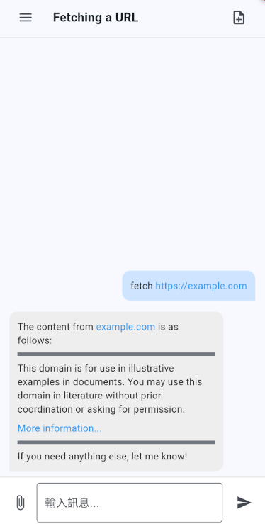

# Dive-APP

> 本專案受 [Dive](https://github.com/OpenAgentPlatform/Dive) 啟發，旨在為行動裝置提供更高的生產力與更智慧的對話體驗。

<p align="center">
  <b>Cross-platform Communication AI Agent APP</b>
</p>

<p align="center">
  <a href="../README.md">📖 EN</a>
  <a href="./docs/README_zh.md">📖 繁體中文</a> |
</p>

<p align="center">
  
</p>

---


## 核心特色

- 🤖 **AI 代理整合**：運用 MCP（Model Context Protocol）使 AI 能夠操作各種工具
- 🔧 **工具自動化**：AI 可通過自然語言指令存取並運用不同工具
- 📱 **行動裝置支援**：將 AI 代理功能帶入手機平台
- 💬 **自然語言介面**：使用自然語言與 AI 互動，完成各種任務
- 🚀 **提升生產力**：透過 AI 輔助簡化工作流程，自動化日常任務

### 行動裝置

透過手機端的前端介面，使用者可以：
- 隨時隨地使用 AI 助理
- 用自然語言描述需求
- 讓 AI 協助處理各類任務
- 大幅提升個人工作效率

## 專案說明

本專案為一個跨平台通訊應用程式，採用 Flutter 框架開發。

> **注意事項**
>
> 本專案目前為個人 Flutter 學習與實驗性質：
>
> - 程式碼含有大量繁體中文註解
> - 存在部分 Code Bad Smell 情況
> - 僅供學習參考，不建議直接用於生產環境
>
> 專案持續更新優化中，歡迎提供建議與回饋。

## 技術架構

### 後端服務

目前後端服務程式碼尚未開放，預計未來將發布穩定版本。

本專案後端基於 [Dive](https://github.com/OpenAgentPlatform/Dive) 專案（[MIT 授權](_third_party_license/OpenAgentPlatform.LICENSE)）改造開發，已針對專案需求進行優化與調整。

### 相關第三方服務授權

授權資訊請參閱 `_third_party_license` 目錄。

### 環境配置

使用前請確認：

1. 後端服務設定完成
2. 服務正常運作中

## 快速開始

1. 安裝必要工具：

   - Flutter SDK
   - Dart SDK
   - Android Studio 或 VS Code
   - iOS 開發需要 MacOS 系統與 Xcode

2. 複製專案：

   ```
   git clone https://github.com/cablate/Dive-APP.git
   ```

3. 安裝依賴：

   ```
   flutter pub get
   ```

4. 啟動應用：
   ```
   flutter run
   ```

## 參考資源

- [Flutter 官方文件](https://docs.flutter.dev/)
- [Dart 程式語言](https://dart.dev/)

## 授權聲明

本專案採用 MIT 授權條款，詳細內容請參閱專案中的 LICENSE 文件。

後端服務部分程式碼改編自 [Dive](https://github.com/OpenAgentPlatform/Dive) 專案（[MIT 授權](_third_party_license/OpenAgentPlatform.LICENSE)）。

## 參與貢獻

我們非常歡迎社群的參與和貢獻！以下是幾種參與方式：

- ⭐️ 給專案一個 Star：若您覺得這個專案有幫助
- 🐛 提交 Issue：回報問題或提供建議
- 🔧 發起 Pull Request：提交程式碼改善

## 聯繫我

如果您有任何問題或建議，歡迎通過以下方式與我聯繫：

- 📧 Email：[reahtuoo310109@gmail.com]
- 🤝 合作提案：若有專案合作需求，歡迎來信討論
- 📚 技術指教：誠摯歡迎提供建議與指教

無論是程式撰寫、架構設計，還是使用者體驗等方面的建議，都歡迎與我分享您的想法。

---
